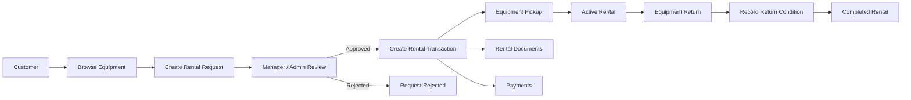
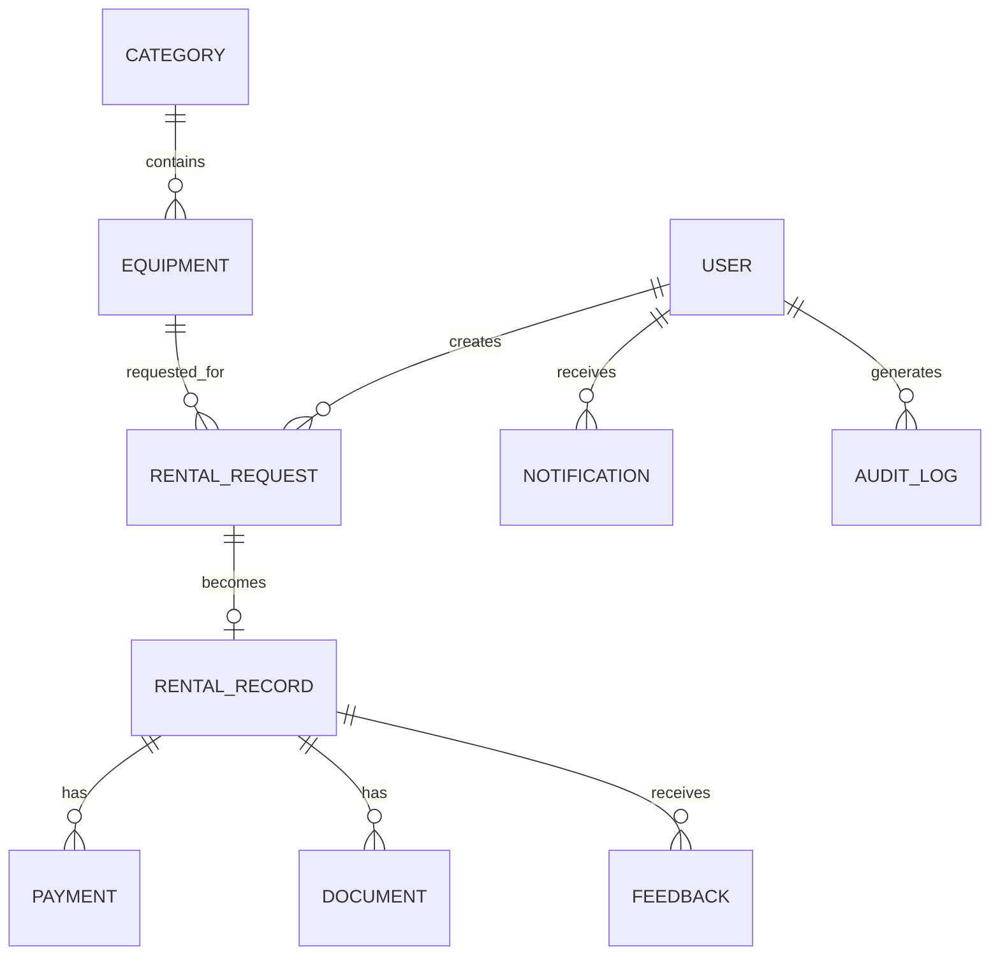
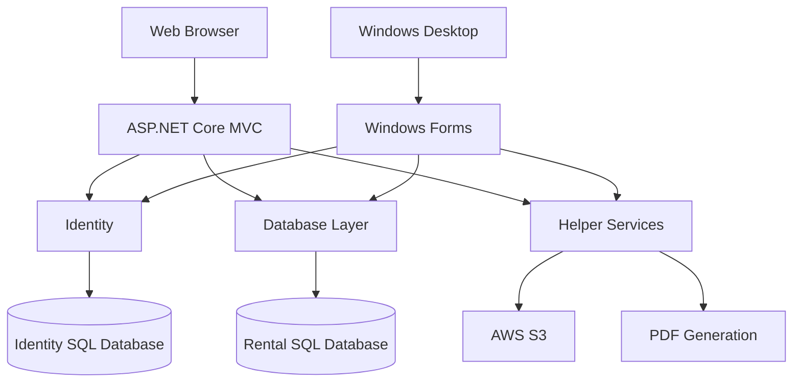

<div align="center">

# TechRental

### Equipment rental management across web and desktop

A full-stack rental management system built with ASP.NET Core MVC, Windows Forms, Entity Framework Core, SQL Server and AWS S3.


</div>

## Overview

**TechRental** is an equipment-rental management system developed as part of the IT8118 Advanced Programming group project.

The system combines an **ASP.NET Core MVC web application** for customers and administrative users with a **Windows Forms desktop application** for internal rental operations.

It manages the rental lifecycle from equipment discovery and rental requests through approval, pickup, return, payment, documentation and auditing.

The solution separates database access, authentication and reusable services into dedicated .NET projects shared by the web and desktop applications.

---

## Features

### Customer

Customers can:

* Browse available equipment
* View equipment information and feedback
* Create rental requests
* Select rental start and return dates
* View dates where equipment is unavailable
* Track rental-request status
* View active rental transactions
* View completed returns
* Access rental documents
* View payment information
* Submit feedback
* Receive system notifications

Customers are restricted to their own rental requests and rental records.

### Manager

Managers can:

* Review rental requests
* Approve and process requests
* Create rental transactions
* Record equipment pickup
* Process equipment returns
* Record return condition
* Review rental records
* Search and filter rental data
* Monitor due and overdue rentals
* Access operational rental information

### Administrator

Administrators have access to system-management functionality including:

* User management
* Equipment management
* Category management
* Rental management
* Audit information
* System administration

Role-specific access is enforced within application controllers and views.

---

## Rental Workflow



The system maintains separate **rental requests** and **rental records**, allowing the approval workflow to remain distinct from the actual rental transaction.

---

## Rental Requests

The rental-request workflow supports:

* Customer-specific request history
* Request status tracking
* Equipment availability validation
* Prevention of conflicting rental dates
* Search by equipment, customer or request ID
* Status filtering
* Date sorting
* Pagination
* Role-aware data access

Customers can only access requests associated with their own account, while Managers and Administrators can access broader rental information.

---

## Rental Transactions & Returns

Once an approved request is converted into a rental transaction, TechRental tracks the operational rental lifecycle.

Rental records contain information related to:

* Equipment
* Customer
* Pickup date
* Expected return date
* Actual return date
* Return condition
* Payments
* Associated documents

The transaction interface distinguishes between:

* **Active transactions**
* **Completed returns**

Active rentals can also be filtered by:

* Overdue
* Due today
* Upcoming

Completed returns can be filtered by equipment return condition.

---

## Role-Based Access

TechRental uses **ASP.NET Core Identity** for authentication and role management.

The application defines three primary roles:

```text id="xgzrph"
Customer
Manager
Admin
```

Access rules are applied throughout the application.

For example:

* Customers can only view their own requests and rental records.
* Managers and Administrators can process rental transactions.
* Administrative functionality such as category management is restricted to Administrators.

---

## Audit & Error Logging

TechRental includes application-level auditing for important system operations.

The database contains dedicated records for:

* `AuditLog`
* `SystemErrorLog`

Audit entries can record information such as:

* User performing the operation
* Action type
* Source entity
* Previous data
* Updated data
* Affected record
* Timestamp

Error logs provide a separate mechanism for recording application failures and their source.

---

## Documents & File Storage

The system includes support for rental-related document handling.

The shared `Helper` project includes dependencies for:

* **PDF generation** using PdfSharpCore
* **AWS S3** object storage
* Image and font processing

Documents are associated with rental records through the database and can be accessed from the rental workflow.

---

## Notifications

The database includes a notification system associated with users and notification types.

Notifications maintain information such as:

* Recipient
* Notification type
* Read/unread state
* Created timestamp
* Updated timestamp

The project also contains email configuration used for application communication.

---

## Data Model

The rental database contains the following core entities:



### Main Entities

The domain database contains:

* Users
* User Roles
* Equipment
* Categories
* Equipment Availability Statuses
* Equipment Condition Statuses
* Rental Requests
* Rental Request Statuses
* Rental Records
* Return Condition Statuses
* Payments
* Payment Methods
* Payment Statuses
* Documents
* Images
* Feedback
* Notifications
* Notification Types
* Audit Logs
* System Error Logs

---

## Solution Architecture

TechRental is divided into five .NET projects:

```text id="f09ec7"
TechRental.sln
│
├── WebApp
│   └── ASP.NET Core MVC web application
│
├── FormsApp
│   └── Windows Forms desktop application
│
├── Database
│   └── Domain models, EF Core context and persistence
│
├── Identity
│   └── Authentication and role management
│
└── Helper
    └── Shared services such as PDFs and file storage
```

The applications reuse the shared projects rather than duplicating database and identity logic.



---

## Technology Stack

| Area           | Technology                       |
| -------------- | -------------------------------- |
| Language       | C#                               |
| Runtime        | .NET 6                           |
| Web Framework  | ASP.NET Core MVC                 |
| Web UI         | Razor Views                      |
| Desktop UI     | Windows Forms                    |
| ORM            | Entity Framework Core 6          |
| Database       | Microsoft SQL Server             |
| Authentication | ASP.NET Core Identity            |
| File Storage   | AWS S3                           |
| PDF Generation | PdfSharpCore                     |
| Frontend       | HTML, CSS, Bootstrap, JavaScript |
| IDE            | Visual Studio                    |

### Main Packages

| Package                    |    Version |
| -------------------------- | ---------: |
| Entity Framework Core      |     6.0.36 |
| ASP.NET Core Identity EF   |     6.0.36 |
| AWS SDK for S3             | 3.7.416.16 |
| PdfSharpCore               |     1.3.67 |
| SixLabors.ImageSharp       |      3.1.8 |
| WinForms.DataVisualization |     1.10.0 |

---

## Project Structure

```text id="joa0rp"
TechRental/
├── WebApp/
│   ├── Controllers/
│   ├── Views/
│   ├── wwwroot/
│   ├── Program.cs
│   └── appsettings.json
│
├── FormsApp/
│   ├── views/
│   ├── Resources/
│   └── FormsApp.csproj
│
├── Database/
│   ├── Core/
│   │   └── Domain/
│   └── Persistence/
│
├── Identity/
│
├── Helper/
│
└── TechRental.sln
```

### `WebApp`

ASP.NET Core MVC application containing the web controllers, Razor views and static frontend assets.

### `FormsApp`

Windows Forms application intended for internal desktop rental operations.

### `Database`

Contains the equipment-rental domain model and Entity Framework Core persistence layer.

### `Identity`

Contains the ASP.NET Identity configuration and user authentication infrastructure.

### `Helper`

Contains reusable functionality shared by the applications, including document and storage-related services.

---

## Getting Started

### Requirements

You will need:

* Visual Studio 2022
* .NET 6 SDK
* Microsoft SQL Server
* Entity Framework Core tools
* Access to the required database and external-service configuration

> **Important**
>
> The project depends on external services and databases. Local execution requires valid configuration for the rental database, Identity database and any enabled storage/email integrations.

### 1. Clone the Repository

```bash id="z0g60l"
git clone https://github.com/memezsxz/TechRental.git
cd TechRental
```

### 2. Open the Solution

Open:

```text id="a07ypf"
TechRental.sln
```

in Visual Studio.

The solution contains both the WebApp and FormsApp startup applications together with the shared libraries.

### 3. Restore Dependencies

From the solution directory:

```bash id="jb6gl7"
dotnet restore
```

Visual Studio should also restore NuGet dependencies automatically when the solution is opened.

### 4. Configure the Databases

TechRental uses separate SQL Server databases for:

* Rental and equipment data
* ASP.NET Identity data

Configure both connection strings before starting the application.

For the web application, configuration is read from:

```text id="qlyr97"
WebApp/appsettings.json
```

Do not commit production usernames, passwords or application credentials.

### 5. Run the Web Application

Set:

```text id="f1vf75"
WebApp
```

as the startup project and run it through Visual Studio, or use:

```bash id="4tyz8h"
dotnet run --project WebApp
```

### 6. Run the Desktop Application

The Windows Forms client requires Windows.

Set:

```text id="caimz9"
FormsApp
```

as the startup project in Visual Studio and run the application.

---

## Demo Accounts

The original project includes accounts for exploring the different roles.

### Customer

```text id="rffx7a"
Email: Shima@gmail.com
Password: As123!
```

```text id="k9kgav"
Email: chloe.perry@example.com
Password: As123!
```

### Manager

```text id="ysljz2"
Email: Manager1@gmail.com
Password: Pa$$word123
```

### Administrator

```text id="y6we7r"
Email: Admin1@gmail.com
Password: Pa$$word123
```

> Demo accounts depend on the original project database remaining available.

---

## Project Status

TechRental is a **completed academic project** developed for IT8118 Advanced Programming.

The repository demonstrates:

* ASP.NET Core MVC development
* Windows Forms development
* Multi-project .NET solution architecture
* Entity Framework Core
* SQL Server integration
* Authentication and authorization
* Role-based workflows
* File and document management
* Audit logging
* Rental transaction processing

---

## Security Notice

Configuration values used during the original development of the project should not be treated as production credentials.

Before exposing or deploying a copy of the system, replace database, email and storage credentials and store sensitive values using environment variables, user secrets or another secure configuration mechanism.
